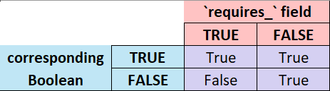

# Get-Your

Get-Your is an online application for income-qualified programs supported by any organization.

This was created for the City of Fort Collins, so references will be to their version of the app, 'Get FoCo'.

# Table of Contents
1. [Get-Your](#get-your)
1. [Background](#background)
1. [Definitions](#definitions)
    1. [Account](#account)
    1. [AMI](#ami)
    1. [Benefits](#benefits)
    1. [City Limits](#city-limits)
    1. [Eligibility Address](#eligibility-address)
    1. [Eligibility Programs](#eligibility-programs)
    1. [GMA](#gma)
    1. [Household](#household)
    1. [IQ Programs](#iq-programs)
    1. [Mailing Address](#mailing-address)
    1. [Platform (codebase)](#platform-codebase)
    1. [Platform Administrator](#platform-administrator)
    1. [Program Coordinator](#program-coordinator)
    1. [Project (codebase)](#project-codebase)
    1. [User](#user)
    1. [Verification Staff](#verification-staff)
1. [Process Flows](#process-flows)
    1. [User Process](#user-process)
    1. [Verification Staff Process](#verification-staff-process)
        1. [User list view](#user-list-view)
        1. [User view](#user-view)
    1. [Program Coordinator Process](#program-coordinator-process)
1. [Project Code Map](#project-code-map)
    1. [Configuration Files](#configuration-files)
        1. [docker-compose.*.yml](#docker-compose-yml)
        1. [LICENSE](#license)
        1. [pyproject.toml](#pyprojecttoml)
        1. [redis.conf](#redisconf)
        1. [supervisord.conf](#supervisordconf)
    1. [`app`](#app)
        1. [app.admin](#appadmin)
        1. [app.backend](#appbackend)
        1. [app.context_processors](#appcontext_processors)
        1. [app.tasks](#apptasks)
        1. [app.views](#appviews)
    1. [`dashboard`](#dashboard)
        1. [dashboard.admin](#dashboardadmin)
        1. [dashboard.views](#dashboardviews)
    1. [`files`](#files)
    1. [`monitor`](#monitor)
    1. [`ref`](#ref)
    1. [`users`](#users)

# Background

The City of Fort Collins provides many income-qualified programs to residents. Prior to Get-Your (and Get FoCo), however, these programs would typically require applicants to

1. Travel in-person to the department that runs a program
1. Fill out a physical form and provide income-verification documentation (usually tax forms)
1. Wait to hear if they've been enrolled (and each program had different methods of response)
    1. This could take quite a while due to the overextended staff at each department

Furthermore, almost every program is run from a different department! These steps posed a large barrier for members of the low-income community, especially because of the amount of time it takes to travel to an office. There was also the problem that Fort Collins didn't have many applicants with overlapping programs, even though most programs have the same level of qualification requirements. This was attributed to the difficulty in learning about the available programs.

Get-Your was designed to solve these problems.

- The first key feature is that users fill out a *single* application which is applicable to all income-qualified programs on the platform. Filling out information only once is a huge reduction in effort for potential applicants
- With it being online-only, there is no travel time. Studies have shown that smartphone usage as a sole Internet-enabled device is high among the intended audience of Get-Your, so it has a mobile-first design
    - For those without Internet access, the application can be filled out at public libraries
    - Critically, for those uncomfortable with web interfaces, the City of Fort Collins has set up in-person help at popular community locations (e.g. the Fort Collins Senior Center)
- Applicants will need to upload ID and paperwork, which can be done with a smartphone camera
    - Additionally, these documents are now stored securely (and soon to be governed by a data retention policy). Since tax forms are no longer allowed, critical PII is not stored at all
- Because there is a single application per user, dedicated staff can be tasked with verifying documents. Once a user has been verified, each program's department only needs to perform their process of enrolling users (no longer verifying themselves)
    - Wait times are lower, and the online nature of the platform can give feedback to the user

# Definitions

## Account
Accounts within Get-Your are created by a [user](#user) on behalf of a [household](#household).

## AMI
AMI stands for Area Median Income, which is the median income of all households in the area that the organization administering Get-Your is located.

For Get FoCo, the City of Fort Collins uses their [Growth Management Area](#gma) as the 'area' the AMI is referring to.

## Benefits
Benefits are defined by each [IQ Program](#iq-programs) and dispersed / made available to all enrolled [accounts](#account).

Benefits within Get-Your apply to the [household](#household) (not an individual person), so while the [user/applicant](#user) who created the [account](#account) may be referenced specifically within this document, all verifications and benefits apply to the entire household.

## City Limits
In the US, the boundaries within which a city is responsible.

## Eligibility Address
The address used to determine geographical eligibility for a household.

This is gathered with the page header 'Where do you live?' as a simple question that doesn't require explaining the behind-the-scenes process to the user.

## Eligibility Programs
External programs that the organization uses to determine income eligibility.

Rather than accept tax documentation or low-level financials, the platform piggybacks off outside organizations for verification purposes (e.g. SNAP and Medicaid); each Eligibility Program is correlated from its source designation to local [AMI](#ami) (Area Median Income). For example, SNAP is defined as 130% of Federal Poverty Level; that translates to 30% AMI in Fort Collins, so that would be the 'AMI threshold' for a SNAP-card upload in Get FoCo.

## GMA
In the US, the Growth Management Area of a city designates the furthest limits that a city can expand. The encompassing county is responsible for services wherever the GMA boundary doesn't match the [city limits](#city-limits).

## Household
A household means the [applicant](#user) and any other people claimed on their federal tax return, included in Get-Your under one [account](#account) (so that [benefits](#benefits) can be provided properly).

This was defined by the City of Fort Collins and Code for America teams that originally set up Get-Your.

## IQ Programs
These are the Income-Qualified Programs offered by the organization via the Get-Your app.

## Mailing Address
The address where mail from Get-Your can be sent.

This can be different than [Eligibility Address](#eligibility-address) to allow for cases where the applicant must temporarily live away from their official residence (such as domestic abuse).

## Platform (codebase)
When referring to the codebase, the "platform" is everything in the repo. This generally references files in the repo root, such as `uv` definitions, .MD documentation, and Git definitions; everything else will likely be referred to by the [project](#project-codebase) moniker, as they are specific to the Django portion of the platform.

The platform is governed by [`uv`](https://docs.astral.sh/uv), which installs the necessary dependencies for the [Django project](#project-codebase) and everything included within.

## Platform Administrator
The Platform Administrator(s) administers the Get-Your platform for their organization. On the platform, they are responsible for defining the Eligibility Programs and IQ Programs.

## Program Coordinator
Get-Your doesn't connect to external systems because it generally assumes [IQ Programs](#iq-programs) are administered by separate departments, so the Program Coordinator(s) are responsible for extracting (verified*) applicants from Get-Your and enrolling them in their specific program in whatever system they use. Once completed, the Program Coordinator(s) will mark each applicant 'enrolled' in Get FoCo so that it's displayed on the user's dashboard.

\* All applicants that can be viewed by the Program Coordinator have already been verified by the [Verification Staff](#verification-staff); see [Verification Staff Process](#verification-staff-process) for additional details.

## Project (codebase)
When referring to the codebase, the Django portion of this repo -- all code within the 'get_your' directory -- is referred to as a "project" (or "Django project"). This is in contrast to the [platform](#platform-codebase), which is governed at the repo root.

## User
A 'user' of the platform is an end-user who has created an [account](#account) on behalf of their [household](#household). This is generally synonymous with 'applicant' in this document.

## Verification Staff
This is the staff member(s) responsible for verification of identification and Eligibility Program uploads. This user(s) will mark each applicant 'verified' once uploads have been confirmed as complete and accurate.

# Process Flows

## User Process
> ![NOTE]
> The [Get FoCo Process Flow](https://user-images.githubusercontent.com/72939569/198737977-8c08368e-d138-4493-a637-df12e332ef4a.png) Fort-Collins-specific details about this process.

Get-Your allows users to create accounts, upload identification and income verification documentation, then apply for income-qualified programs. A new user's process is described below, starting with selecting 'Apply' from the main landing page:

0. Preliminary step: the user is displayed a 'before we get started' page with descriptions of the [accepted external programs] ([Eligibility Programs](#eligibility-programs)) as well as the organization's [privacy policy]. This page is informational.

    This is defined with `app.views.get_ready()`.

1. Account creation: the user enters their name, email, and phone number, and a password to create an account.

2. Address: the user enters the address at which their household resides (their [Eligibility Address](#eligibility-address)), as well as a separate mailing address, if applicable.

    The system will attempt to confirm each address with USPS. See [Address] for additional details on the usage of these addresses and confirmation steps.

3. Household information: the user enters minimal demographic information, then the number of individuals in their household. The 'number of individuals' is used solely to populate the next page; this is planned to be removed as a form field (instead inferred from the information entered) so that both parts of this step are on a single page.

    On the next page, the user enters the full name and birthdate and uploads a form of identification for each individual in the household. See [Supported Identification] for additional details on this upload.

4. Eligibility Program selection: from a list of external programs (the [same as in the preliminary step]), the user chooses all they are enrolled in.

5. Eligibility Program uploads: the user is prompted to upload supporting documentation for each program selected in the prior step.

6. New account confirmation: a page is displayed that confirms the account, and says that the user will be sent an email and text to confirm as well. See [User Communication] for additional details on the notifications.

7. Dashboard: The user can then continue to the dashboard, where all income-qualified programs ([IQ Programs](#iq-programs)) the user is eligible for are displayed in the 'Available Programs' section (those that the user doesn't qualify for are not included at all), along with a News section and a simple user-feedback mechanism.

    The user can select 'Apply Now' next to any displayed program, at which point the system will display a confirmation page and that program will be moved to the 'Pending Approval' section. Once the user is enrolled for a program, it will be displayed in the 'Active Programs' section.

This was designed to be synchronous for the user; all steps can be completed in one sitting, without needing input from the organization. The organization will, of course, need to verify that the provided information is complete and correct, but this is done after the user has completed the entire application.

The system assumes that the Eligibility Address and Eligibility Programs (from Steps 2 and 4) are correct in order to filter IQ Programs for geographical location and income level. This allows the user to immediately see all available programs in their dashboard and make their selections.

After the application is completed by the user, the organization begins the process of verifying all uploads match the ID and Eligibility Programs they're supposed to. If more information is need or if there's a discrepancy, this can be handled manually by the [Platform Administrator](#platform-administrator) (by reaching out to the applicant).

## Verification Staff Process
This process doesn't begin until after the [user process](#user-process) is complete, in part so that the user process isn't interrupted by staff activity.

### User list view
The Get-Your 'user list' can be accessed from the 'Users' menu in the Get-Your [administration portal]. From here, [verification staff](#verification-staff) can access all newly-completed applicants by selecting the 'New Needs Verification' filter on the right sidenav. This limits the users to only those who are newly awaiting identification / Eligibility Program verification.

> ![NOTE]
> Other filter options are 'Awaiting Response' (only users who staff have marked as 'awaiting user response' (see [below](#administration-section))), 'All Needs Verification' (all users who needs verification, regardless of 'awaiting user response'), 'Has Been Verified' (only users who are marked as 'income has been verified'), and 'All' (no verification filter). See [Administration Portal] for additional details.

> ![NOTE]
> The default filter for the user list is 'By account disabled' > 'Not disabled', so all filters mentioned here are limited to only active accounts.

From the user list, staff will select a user via their hyperlink email address.

### User view
The resulting view contains pertinent information from the user. Only the user-verification ["happy path"](https://en.wikipedia.org/wiki/Happy_path) is included in this section; other cases can be found in [Troubleshooting].

> ![NOTE]
> Verification staff are part of a specific [authorization group] on the platform, and therefore will have the minimum privileges necessary to perform verifications. See [Authorization groups] for more details.

Once [Household Member section](#household-member-section) and [User Eligibility Programs section](#user-eligibility-programs-section) have been completed, verification staff will select the checkbox under 'INCOME HAS BEEN VERIFIED' in the 'HOUSEHOLD' section and save changes (via the 'SAVE' button at the bottom of the page). This will make the user visible for the [Program Coordinator process](#program-coordinator-process).

#### Administration section
The section titled 'ADMINISTRATION' is for use by internal staff, and will not be viewable by the user. Here, notes can be made about an account, as well as an account flagged as 'awaiting user response' (to be excluded from some user-list filters).

#### Household Member section
The section titled 'HOUSEHOLD MEMBER' shows all individuals in the user's household. Below each person is a link to the uploaded identification documentation for that person (or 'no document available' if it somehow doesn't exist); verification staff should verify that each ID matches the person it's linked to, that the birthdate is correct, and that at least one person's address matches the Eligibility Address in the 'ADDRESS' section (unless other accomodations have been made).

#### User Eligibility Programs section
The section titled 'USER ELIGIBILITY PROGRAMS' shows each program the user has selected, with link(s) to uploaded documents for each. Verification staff should verify that each uploaded document matches a member of the household.

## Program Coordinator Process
This process doesn't begin until after the [verification staff process](#verification-staff-process) is complete, so that [Program Coordinators](#program-coordinator) are using accurate user information.

This process doesn't exist on the platform yet (it's currently executed in the form of downloading data extracts and emailing them as CSVs to each Program Coordinator, via [a script in the `Get-Your-utils` repo](https://github.com/Get-Your/Get-Your-utils/blob/main/get_your_utils/python/run_extracts.py)), but it's planned to be similar to the [Verification Staff process](#verification-staff-process) but with each Program Coordinator having access only to enroll/unenroll users from their own program (using an as-yet-undefined Program Coordinator [authorization group]).

# Project Code Map
Here you will find architecture decisions around files and functions. All relative paths are in reference to the root repo folder (where this file is located).

> ![NOTE]
> Starting with v7.0.0, the code is formatted around the [`cookiecutter-django`](https://cookiecutter-django.readthedocs.io/en/latest) project. The structure differs significantly from the v6- code, although the function-level architecture is similar (if not exact).

After the [Configuration Files](#configuration-files) definitions are the portions of the Django project, which are separated into apps for responsibility segregation. Each subsection is an app in the project (located within 'get_your'), with further subsections as scripts within that app, then functions/classes (e.g. `app` > views > programs() is accessible to Django at `app.views.programs()` and can be found in the file tree at 'get_your/app/views.py > `programs()`')

> ![NOTE]
> Only the pertinent scripts/functions are called out here.

> ![NOTE]
> `models.py` for each app are not included here. The purpose of this document is to detail why the project is designed how it is; the models follow those design decisions.

## Configuration Files
These are the non-Django configurations files, such as for [Redis](https://github.com/redis/redis) and [Docker](https://docs.docker.com) containerization.

### docker-compose.*.yml
These docker-compose files configure the container/docs for distribution. **They have not yet been modified beyond the definition set up by cookiecutter-django.**

### LICENSE
The [GPLv3](https://choosealicense.com/licenses/gpl-3.0) license was selected for all code in this repo because of the broad allowed usage of this software, while ensuring all modified copies remain copyleft (with the same license).

> ![NOTE]
> The [Affero version](https://choosealicense.com/licenses/agpl-3.0) of this license (AGPLv3) was considered, but the source-code-availability clause was deemed too restrictive for the consumer-facing portion of this app.

### pyproject.toml
There are two pyproject.toml files in this repo. The higher-level is in the repo root and is specifically for the containing `uv` definitions ('pyproject.toml'); it isn't pertinent to this section. The pyproject.toml here ('get_your/pyproject.toml') governs only the Django project; this hasn't been modified from the definition set up by cookiecutter-django (and likely won't need to be).

### redis.conf
The configuration file for Redis, as used by all Get-Your environments.

It's unclear at this writing what has been changed from the defaults, if anything.

### supervisord.conf
The configuration for [Supervisor](https://supervisord.org) process control system, used with Docker containers. This is currently marked with ' - Copy' because it's in the same state as it was in Get-Your v6; it hasn't been determined if cookiecutter-django has a built-in method that would/should replace this.

## `app`
This is the user-application part of the project.

### app.admin
...

### app.backend
> ![NOTE]
> The functions in this app are split into separate files within the 'get_your/app/backend/' directory.

#### file_validation()
This validation function uses the `python-magic` utility to determine the type of the (user-uploaded) file. This is done so that the filetype can be confirmed without relying on the file extension, which could be manually changed for malicious purposes.

The check for a minimum `django.core.files.File.DEFAULT_CHUNK_SIZE` in 'get_your/config/settings/base.py' ensures that the instance follows `python-magic` recommendations.

#### finalize_application()
This is the final step in the automated workflow for the user's application/renewal. A big part of this step is auto-enrolling a renewal user in programs they were already enrolled in (if they're still eligible).

This function is largely necessary because of the decision to not modify data outside a function/view's working model (and, before this, the data model setup itself). For example, a portion of this function finds the minimum AMI from the selected Eligibility Programs and sets `income_as_fraction_of_ami` in the `Household` model; if `income_as_fraction_of_ami` existed in a different model or the 'Eligibility Programs' view was updated to modify the `Household` model, this functionality would be unnecessary to have in a dedicated step.

#### get_eligible_iq_programs()
This function retrieves all IQ Programs for which the user is geographically eligible. To keep Get-Your as extensible as possible regarding program requirements, it's set up to match a '\<field name\>' Boolean with 'requires_\<field name\>' (e.g. matching 'is_in_gma' with 'requires_is_in_gma') so that new requirements necessitate adding new fields only, not additional logic.

Each requirement is compared with the corresponding field, then they're all chained together to determine the overall user eligibility for a specified program. Fields beginning with `requires_` permissively specify whether the matching field (in the `AddressRef` model) is a filter for the program, so a True value in the `requires_` field requires the corresponding address Boolean to also be True to be eligible. Because it's permissive, a False value in the `requires_` field means that all addresses are eligible, regardless of the value of the corresponding Boolean. Or as a truth table:

An address is eligible for benefits under the following conditions:

    === ( (corresponding Boolean) OR NOT(`requires_`) )

Due to the permissive nature of the individual `requires_` fields,
multiple `requires_` criteria are then ANDed together for the overall
eligibility. For example, if no `requires_` fields are enabled, *all*
addresses are eligible (eligibility = True AND True AND True AND ... ==
True), but if any one of the `requires_` fields are enabled, an address is
ineligible if it doesn't meet that criteria (eligibility = True AND False
AND True AND ... == False).

> ![NOTE]
> The 'requires_' fields could be named more clearly to show that they are specific to geographical (address) requirements.

#### get_iq_program_requires_fields()
This function collects all `requires_` fields for comparison with the corresponding Boolean fields.

#### what_page()
This function is used to check a user's place in the application on login. It uses to the existence of key objects to infer a user's application state; this is caused issues with the renewal workflow, for example when the 'renewal mode' isn't set correctly and this implicit state assumes the user is filling out the application for the first time. This needs to be an explicit check rather than relying on existence (a la [`what_page_renewal()`](#what_page_renewal), although JSON isn't the ideal data storage method).

#### what_page_renewal()
This is the 'renewal' version of [`what_page()`](#what_page), with a key improvement that it uses explicit definitions when a user has completed certain steps. It has room for further improvements, however, namely that if the data were stored in a M2M table the completed steps could be modified by staff in the admin portal.

### app.context_processors

#### global_template_variables()
These are variables that are passed to all templates, due to their use in multiple (if not all) templates.

### app.tasks
The purpose of this file is to define the properties of scheduled tasks that are* run by [Django-Q2](https://django-q2.readthedocs.io/en/master), a native-Django task queue and scheduler. The tasks here also make use of [Redis](https://github.com/redis/redis) for caching.

\* These scheduled tasks have not yet been approved for production; for Get FoCo, the functions in this file have been run locally when needed, and don't include any Redis caching.

#### populate_cache_task()
This will be run directly by Django-Q2 at a scheduled interval. It's meant to loop through all users and create a Django-Q2 asynchonous task for each, to update or add to the Redis cache (via `populate_redis_cache()`), although it appears to currently just create a single async task for the entire loop. These async tasks are automatically distributed amongst the defined number of Django-Q2 'workers', which all process independently and concurrently (therefore, a single async task doesn't actually run anything asynchronously).

#### run_renewal_task()
This will be run directly by Django-Q2 at a scheduled interval. It loops through applicable users to decide who should receive a renewal notification email (based on the cache value for that user), then creates a Django-Q2 asynchronous task to send the email. These async tasks are automatically distributed amongst the defined number of Django-Q2 'workers', which all process independently and concurrently.

`send_renewal_email()` is the function used by each worker to send the email, if applicable.

#### send_generic_email()
This will allow sending any Sendgrid template (via a template name (from the environment variables) or the Sendgrid template ID) to a list of users on the platform. The idea is that a user on the admin portal (with the proper privileges) would be able to just select a subset of users and an email template, without requiring code changes for that specific case, although it hasn't been created.

### app.views

#### address()
This is the first view in the address flow - a user inputs their Eligibility Address (prefaced as "where do you live?") and, optionally, a separate Mailing Address. When the user selects the 'submit' button, the app sends them to [`address_correction()`](#address_correction).

#### address_correction()
This function takes the user-input address from `address()` (or each address, one at a time) and attempts to coerce it so that the USPS API can properly identify it. The current incarnation has up to three loop iterations; each loop iteration ends with an attempted USPS identification, so this isn't included here (the loop exits if the USPS identification is successful):

1. Format the input address into a string, removing any '#' signs (this doesn't play well with the following methods), then pass it into the `usaddress` utility to attempt to "tag" each part properly (tags are things like 'StreetName' and 'PlaceName' (city); see `app.backend.address.tag_mapping` for all available tags).
2. ??? - how is this different than the first iteration?
3. For the last loop, proceed to identification with the input address with no changes

After completion of the loop, the user is prompted to confirm the identified address or directed to go back and modify the input if more information is needed. If the user confirms the identified address, the flow proceeds to [`take_usps_address()`](#take_usps_address).

Known issues:
- The tag mapping for `usaddress` is quite primitive and is the probable reason for address issues we've seen. Better yet, `usaddress` should probably be replaced as it has since become stale
- This method can't identify units with a letter/number combination if the letter is on the wrong end
- ...
- For the case where the user is sent back to modify their input, the 'back' button on the page clears the address form. The browser 'back' button accurately retains the previously-input information, however, which is the functionality that needs to be on the page

#### take_usps_address()
This function uses the identified address, determines if the address is in the GMA and whether Connexion* is available, then saves the address to the database (creates/updates the address in `AddressRef` and uses that value in the user's `Address` entry).

\* 'Connexion' is the branding for the fiber utility operated by the City of Fort Collins. This check was set up specifically for Get FoCo and should be removed from future iterations of Get-Your. 

#### index()
The majority of this page is static (or pseudo-static, e.g. the Available Income Eligible Programs that are dynamically generated server-side then delivered to the client as static), but the bottom of the page has a 'Check Availability' section with a POST action to the address-parsing code.

#### household_definition()
The 'household definition' (as spelled out in 'get_your/get_your/templates/application/household_definition.html') is detailed in the [Household definition](#household).

#### notify_remaining()
This view uses the logic in [`app.backend.what_page()`](#what_page) to notify the user that they have an in-progress application. This is currently its own page and gives the user the option to 'continue' or 'go back' (log out), but this is a superfluous page with an illusion of choice* - this should be converted to an informational modal on the page that the user will be redirected to in order to complete their application.

\* The user has come back to the platform and logged in, so why would they want to immediately log out? Therefore 'go back' is unnecessary, leaving a single option to 'continue', which isn't a choice. The user shouldn't have to perform an action to select an option that isn't an option at all.

## `dashboard`
This is the post-application user dashboard, which contains [IQ Program](#iq-programs) enrollment details, organization news, and user access to update (some of*) their information.

\* See [??????] for more details on what information can be updated after the application process and why.

### dashboard.admin
...

### dashboard.views

#### apply_now_modal()
This is a test for an HTMX modal that could be used for programs that require an additional vendor-specific privacy policy that must be accepted for the user to proceed. It's not currently in use in a Production environment.

## `files`
This is the portion of the project that handles file uploads.

## `monitor`
This part of the project handles project monitoring, specifically logging.

## `ref`
All reference data are within this part of the project.

## `users`
This part of the project handles users; it's a custom user model, created by `cookiecutter-django` and modified for use by Get-Your.

> ![IMPORTANT]
> This app is within the 'get_your' subdirectory, so the app name is actually `get_your.users`; it's shortened in the header for simplicity only.